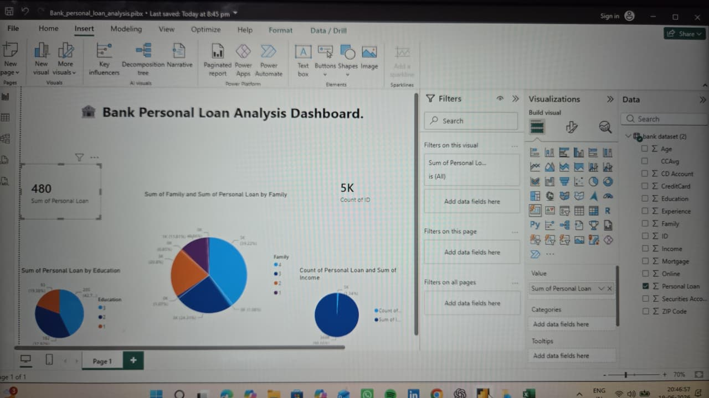

# Bank Loan Analysis Dashboard

## Overview
This project analyzes bank loan applicant data to identify approval trends, customer profiles, and risk factors using Excel, SQL, and Power BI.

## Tools Used
- Microsoft Excel
- SQL
- Power BI

## Objectives
- Analyze loan approval patterns
- Identify high-risk applicants
- Visualize customer demographics
- Support business decision making
## Project Status

✅ Project Completed

## Tools Used

- Power BI
- Microsoft Excel
- GitHub

## Key Insights

- Education level influences personal loan acceptance.
- Family size impacts loan acceptance patterns.
- Customer income plays an important role in loan decisions.
  ## Dashboard Preview

## Project Files

📊 Power BI Dashboard: Bank_personal_loan_analysis.pibx.pbix
